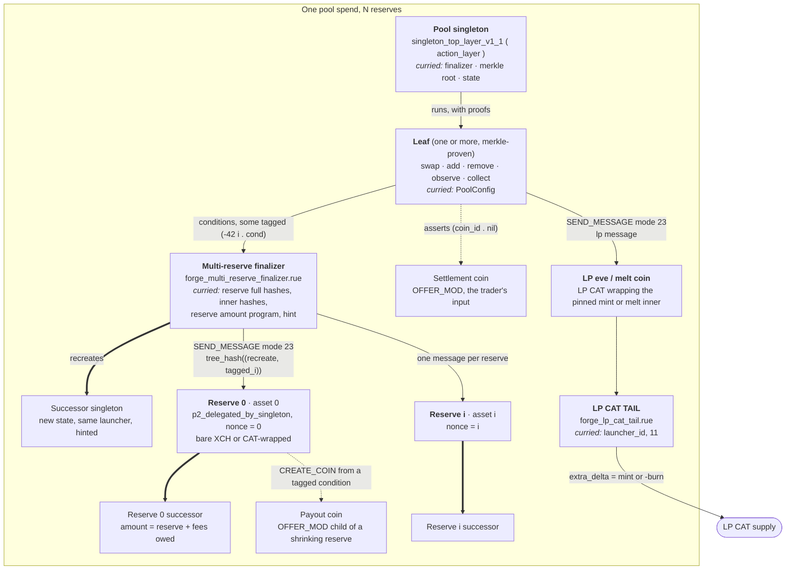
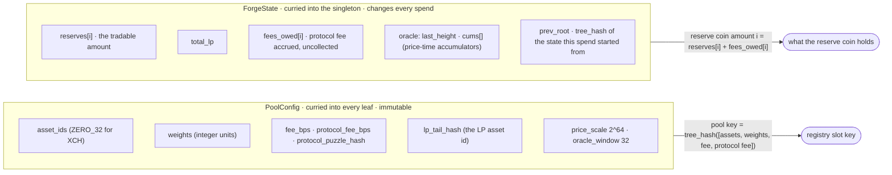
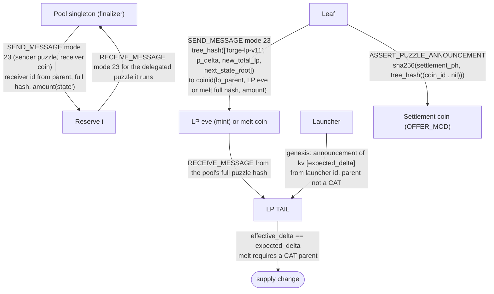
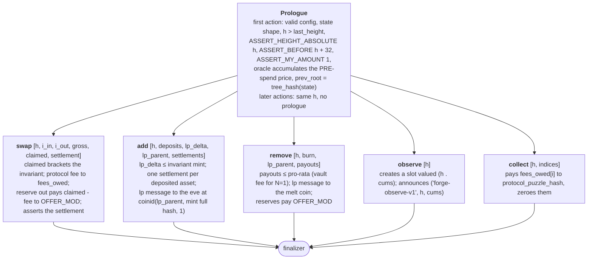
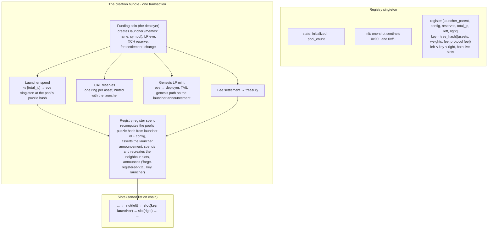
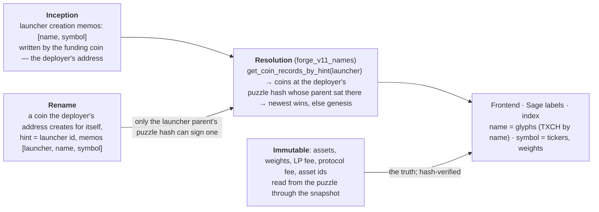
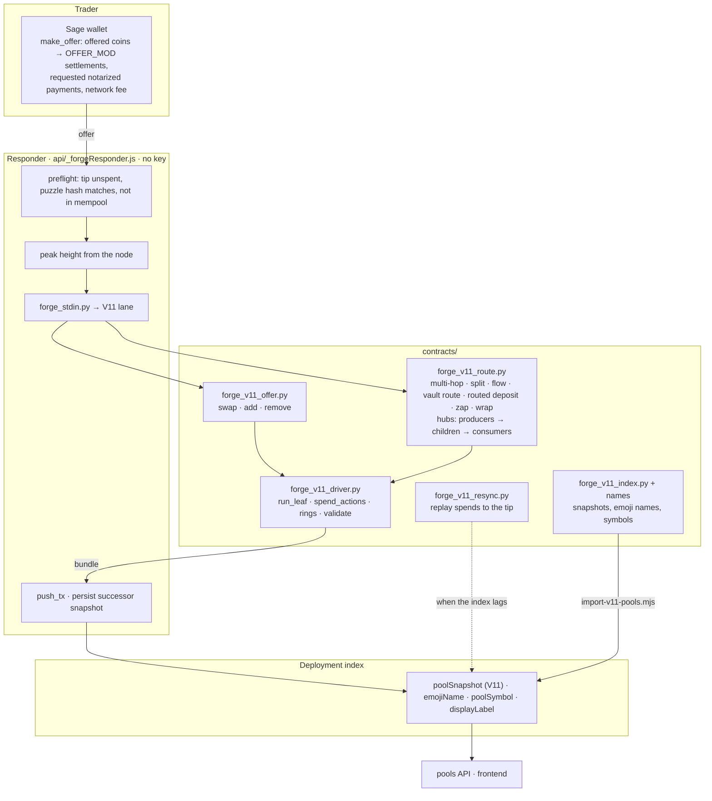
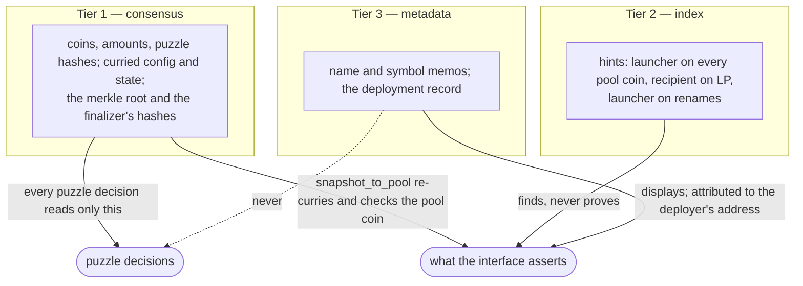

# Forge V11 — architecture, as built

**Updated 2026-09-05.** This describes the V11 that runs on testnet11: the
CHIP-0050 action layer under `contracts/v11`, the registry, the LP CAT, the
keyless responder and its lanes, and the naming layer. The design-phase version
of this document (V10 panels beside V11 targets) is superseded; where a target
was met the picture below is the built shape, and where it was not, the
difference is stated. The workflow charts that pair with this document are the
Workflow Atlas artifact (linked from `FORGE_V11_FOUNDATIONS.md`, phase 8).

Contents:

1. [Coin topology of one pool spend](#1-coin-topology-of-one-pool-spend)
2. [Spend anatomy: action layer and finalizer](#2-spend-anatomy-action-layer-and-finalizer)
3. [State and config](#3-state-and-config)
4. [Authorization: what binds what](#4-authorization-what-binds-what)
5. [The five leaves](#5-the-five-leaves)
6. [The registry and the creation bundle](#6-the-registry-and-the-creation-bundle)
7. [Names: inception, name, symbol](#7-names-inception-name-symbol)
8. [Off chain: driver, lanes, responder, index](#8-off-chain-driver-lanes-responder-index)
9. [Trust tiers](#9-trust-tiers)
10. [What is not built](#10-what-is-not-built)

---

## 1. Coin topology of one pool spend

A pool is one singleton whose inner puzzle is the upstream **action layer**
curried with a **finalizer**, a **merkle root** over five leaves, and the
**state**. Reserves are separate coins that obey the pool through CHIP-0025
messages. Everything a spend creates is hinted with the launcher id.

**What each piece is for.** The singleton decides; the action layer only runs
leaves it can prove against its root and hands their conditions to the
finalizer. The finalizer is the one place that recreates the singleton and
speaks to the reserves, so a leaf cannot move a reserve except through a
tagged condition the finalizer routes. A reserve holds one asset and does
nothing but obey the message its pool sent it in the same block. The LP eve and
melt coins exist so a supply change cannot be faked: their inner puzzles have
no branch but the TAIL, and the TAIL takes its authority from the pool's
message.

---

## 2. Spend anatomy: action layer and finalizer

The solution the singleton receives, and the order things run in.

```mermaid
flowchart LR
    subgraph sol["Inner solution"]
        direction TB
        S1["puzzles<br/>each distinct leaf once, in order of first use"]
        S2["selectors_and_proofs<br/><b>reverse</b> execution order;<br/>a proof only on the last use of a selector"]
        S3["solutions<br/>one per action, execution order"]
        S4["reserve parent ids<br/>one per reserve"]
    end
    subgraph run["Action layer"]
        direction TB
        A1["verify leaf i against the merkle root"]
        A2["run leaf i on ((ephemeral . state) . solution_i)"]
        A3["leaf returns ((ephemeral' . state') . conditions)"]
        A4["prepend conditions; state' feeds leaf i+1"]
    end
    subgraph fin["Finalizer, once"]
        direction TB
        F1["walk conditions LAST action first"]
        F2["untagged → the singleton's own conditions"]
        F3["tagged (-42 i . c) → prepend to reserve i's list"]
        F4["CREATE_COIN successor singleton<br/>ASSERT_MY_PUZZLEHASH"]
        F5["per reserve: SEND_MESSAGE mode 23 to<br/>coinid(parent_i, full_hash_i, amount(state', i))<br/>message = tree_hash((recreate_i, conditions_i))"]
    end
    sol --> run --> fin
```

Two rules the driver mirrors exactly. **Ephemeral state** is the height `h`
named by the first action; every later action in the same spend must name the
same `h`, and the prologue (height bind, oracle accumulate, `prev_root`) runs
once. **Per-reserve order** is each action's tagged conditions reversed,
concatenated in execution order, because the action layer prepends lists and
the finalizer walks them last-first; a bundle built in any other order fails
the message pairing (error 147).

A reserve's delegated puzzle is `(1 . [recreate, *tagged_for_i])`: recreate
itself at `reserve_i + fees_owed_i` with the launcher as hint, then whatever the
leaves asked (a payout coin, an announcement). The reserve's
`p2_delegated_by_singleton` receives the pool's message for exactly that
delegated puzzle, so nothing else can be run against it.

---

## 3. State and config

The reserve coin holds more than the tradable reserve whenever fees are owed;
quotes read `reserves`, the finalizer sizes coins from both. `prev_root` chains
the states so a history can be replayed from the spends alone, which is how
`forge_v11_resync.py` rebuilds a lagging snapshot.

---

## 4. Authorization: what binds what

Every binding is a CHIP-0025 message or a launcher announcement; no puzzle
takes an authorizing coin id from its own solution. The settlement assertion
binds a coin, not an amount, which is what lets a payout coin become the next
pool's settlement inside one bundle and lets one entry coin fan out to
children (section 8).

---

## 5. The five leaves

Every leaf runs the same prologue, then its own rule; the merkle root commits
to exactly these five.

The swap prices on the state the pool is actually in when the action runs, so
two swaps in one spend price sequentially and a stale second quote is refused.
Observe records the pre-spend price, so a manipulation in the same spend cannot
poison the oracle.

---

## 6. The registry and the creation bundle

A pool exists only if it is registered, and it registers in the same
transaction that mints it; a second pool with the same key is refused because
its slot already exists. The creation fee is the gate today; an NFT or
allowlist check runs off chain first (phase 8.9).

---

## 7. Names: inception, name, symbol

A pool's identity is its launcher id and the puzzle hashes recomputed from it;
its **name** and **symbol** are metadata, set at mint and updatable by the
deployer, never inputs to any decision.

Forge is word-minimal: the emoji is the market. The name is the assets'
glyphs (TXCH stays a word: the base asset must be readable); the symbol is the
tickers and weight ratio; the fee is shown from the puzzle. A one-asset pool is
just a pool and its deployer may name its LP as a new token. A memo can be
wrong or malicious; it can never change what a pool is, because everything the
interface asserts about a pool is recomputed from tier 1.

---

## 8. Off chain: driver, lanes, responder, index

**Hubs** are the route composer's one idea: for each asset on a route, the
coins holding it (offer settlements, payouts, redemptions, LP mints) are
producers and the legs that drink it are consumers. One producer and one
consumer bridge directly; otherwise the producers are spent in one ring and the
first pays each consumer a child settlement, the trader's requested payments,
and the remainder to the surplus recipient. Amounts are re-derived per leg on
the pool's current state, and a pool crossed twice runs two actions in one
spend.

---

## 9. Trust tiers

---

## 10. What is not built

Named so this document does not overstate: offer-driven pool creation through
the registry (the deployer's own script creates today); a vault crossed forward
inside a route (an add mid-route); the DAO fee field (a revision, decided with
V11.1); a name or symbol inside the registry slot or launcher kv list (a leaf
change, deferred with the same decision); the wallet-sdk second driver; the
written CLVM audit pass. The build order is phase 8 in
`FORGE_V11_FOUNDATIONS.md`.

## Where these diagrams come from

| Section | Source |
|---|---|
| 1, 2, 4, 5 | `contracts/v11/puzzles/*.rue`, `forge_v11_driver.py` (`spend_actions`, `assemble`, `run_leaf`), `_test_v11_actions.py`, `_test_v11_finalizer.py` |
| 3 | `forge_action_common.rue` (`PoolConfig`, `ForgeState`, `prologue`), `forge_reserve_amount.rue` |
| 6 | `forge_registry_*.rue`, `scripts/deploy-v11-testnet.py create-pool`, `_test_v11_registry.py` |
| 7 | `forge_v11_names.py`, `deploy-v11-testnet.py rename`, `forge_v11_index.py` |
| 8 | `forge_v11_offer.py`, `forge_v11_route.py`, `api/_forgeResponder.js`, `scripts/import-v11-pools.mjs`, `forge_v11_resync.py` |
| 9 | `forge_v11_offer.snapshot_to_pool`, `_test_v11_discoverability.py` |
