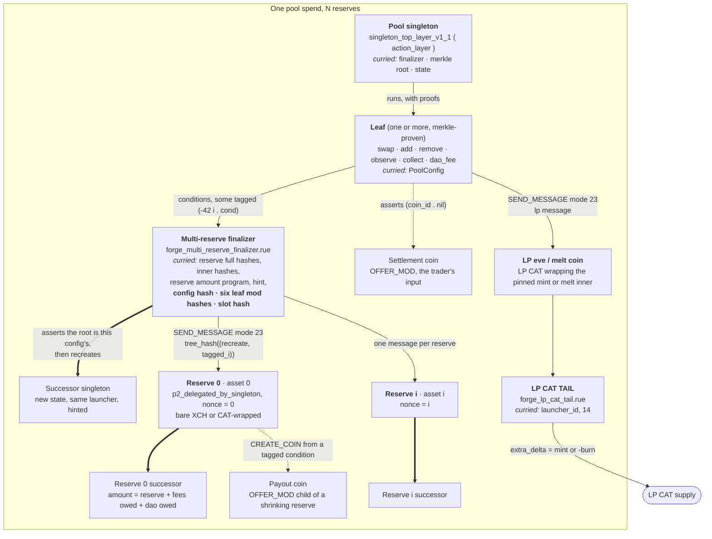
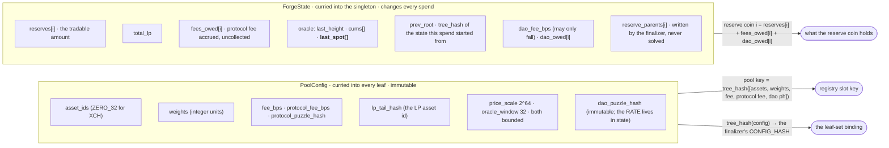
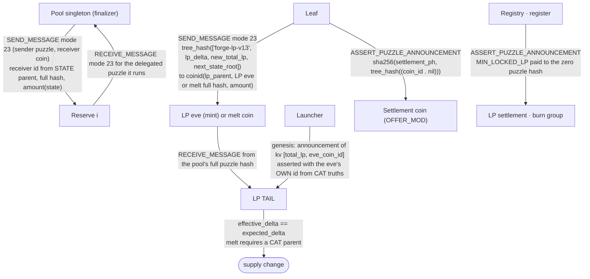
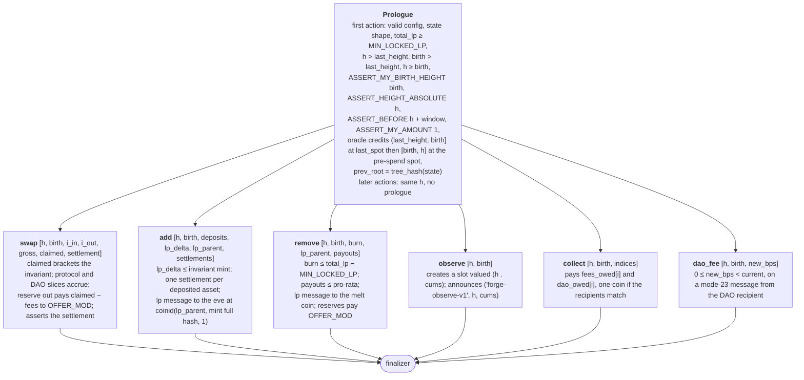
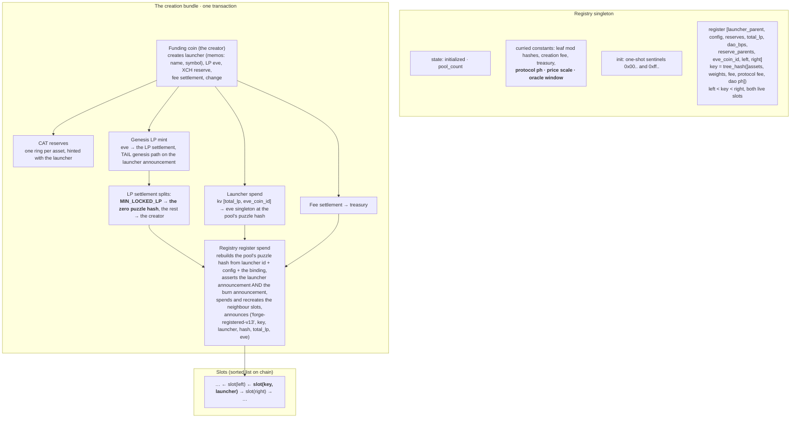
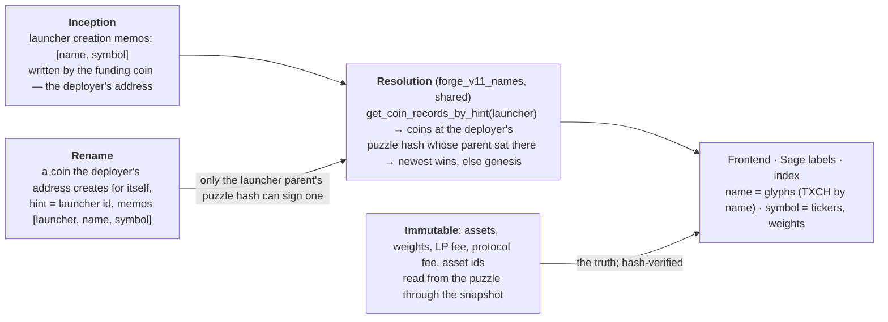
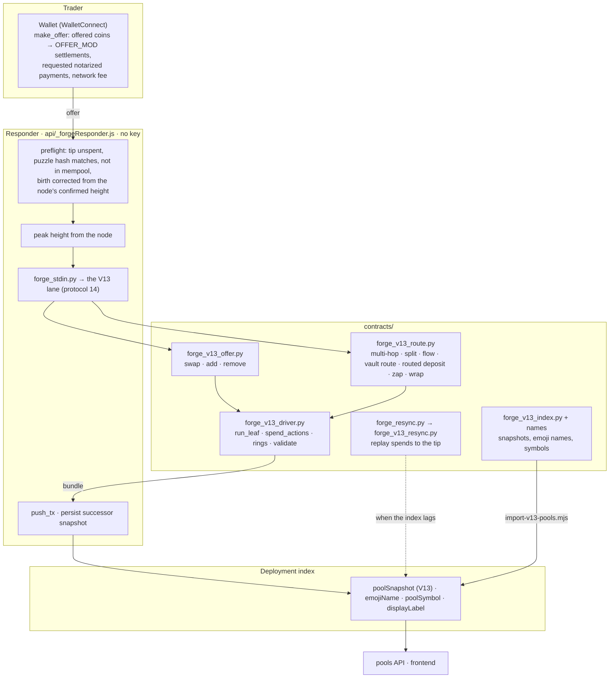
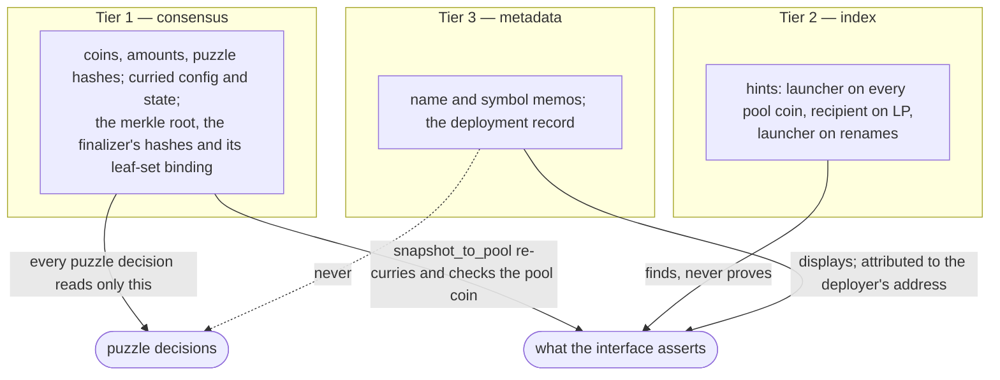

# Forge V13 — architecture, as built

> **Erratum (2026-09-15).** Section 5's leaf diagram writes `lp_delta ≤ invariant mint`
> and `payouts ≤ pro-rata`. Both are **exact**, not upper bounds: `exact_invariant_lp_mint`
> and `exact_withdrawal` are brackets, and an `add` asking for one LP less than the bracket
> or a `remove` asking for one mojo less than pro-rata is refused. An implementer who
> requested less defensively would be refused, and this document would have told them it
> was allowed. `burn ≤ total_lp − MIN_LOCKED_LP` is a genuine bound and stands.

**Updated 2026-09-15.** This describes the V13 that runs on testnet11: the
CHIP-0050 action layer under `contracts/v13`, the registry, the LP CAT, the
keyless responder and its lanes, and the naming layer. V13 is **protocol 14**.
It replaces V12 (protocol 13), which a second independent review retired after
demonstrating a full drain of a pool whose six leaves did not share one
configuration; V12's liquidity was withdrawn and its sources removed from the
public repository, as V11's were before it.

Where V13 differs from the shape V11 introduced, the difference is called out
inline rather than left for the reader to spot. The leaf-by-leaf reading of the
compiled puzzles is `FORGE_V13_CLVM_PASS.md`; the specification is
`FORGE_PUZZLE_V13.md`.

Contents:

1. [Coin topology of one pool spend](#1-coin-topology-of-one-pool-spend)
2. [Spend anatomy: action layer and finalizer](#2-spend-anatomy-action-layer-and-finalizer)
3. [State and config](#3-state-and-config)
4. [Authorization: what binds what](#4-authorization-what-binds-what)
5. [The six leaves](#5-the-six-leaves)
6. [The registry and the creation bundle](#6-the-registry-and-the-creation-bundle)
7. [Names: inception, name, symbol](#7-names-inception-name-symbol)
8. [Off chain: driver, lanes, responder, index](#8-off-chain-driver-lanes-responder-index)
9. [Trust tiers](#9-trust-tiers)
10. [What is not built](#10-what-is-not-built)

---

## 1. Coin topology of one pool spend

A pool is one singleton whose inner puzzle is the upstream **action layer**
curried with a **finalizer**, a **merkle root** over six leaves, and the
**state**. Reserves are separate coins that obey the pool through CHIP-0025
messages. Everything a spend creates is hinted with the launcher id.

**What each piece is for.** The singleton decides; the action layer only runs
leaves it can prove against its root and hands their conditions to the
finalizer. The finalizer is the one place that recreates the singleton and
speaks to the reserves, so a leaf cannot move a reserve except through a tagged
condition the finalizer routes. A reserve holds one asset and does nothing but
obey the message its pool sent it in the same block. The LP eve and melt coins
exist so a supply change cannot be faked: their inner puzzles have no branch but
the TAIL, and the TAIL takes its authority from the pool's message.

**What V13 adds here.** The finalizer now also carries the configuration's hash,
the six leaf module hashes and the observe leaf's slot hash, and asserts that the
action layer's merkle root is exactly the root those produce. The action layer
proves that each leaf it runs is *a member* of the root; it never proved that the
six leaves agreed with one another, and six leaves curried with six different
configurations form a perfectly valid root. A pool whose `remove` leaf alone named
a foreign LP TAIL therefore released its reserves against a worthless self-minted
asset. That is closed at the coin level now, and it has a second effect worth
stating: the leaf hashes sit in the finalizer's curry in the clear, so a verifier
reads them off the coin and compares them against the published set. The binding
does not stop an unrelated puzzle existing — nothing can — it makes the leaf set
legible.

---

## 2. Spend anatomy: action layer and finalizer

The solution the singleton receives, and the order things run in.

```mermaid
flowchart LR
    subgraph sol["Inner solution"]
        direction TB
        S1["puzzles<br/>each distinct leaf once, in order of first use"]
        S2["selectors_and_proofs<br/><b>reverse</b> execution order;<br/>a proof only on the last use of a selector"]
        S3["solutions<br/>one per action, execution order<br/>each begins [h, birth, …]"]
    end
    subgraph run["Action layer"]
        direction TB
        A1["verify leaf i against the merkle root"]
        A2["run leaf i on ((ephemeral . state) . solution_i)"]
        A3["leaf returns ((ephemeral' . state') . conditions)"]
        A4["prepend conditions; state' feeds leaf i+1"]
    end
    subgraph fin["Finalizer, once"]
        direction TB
        F0["<b>assert Merkle_Root == config_root(LEAVES, CONFIG_HASH, SLOT)</b>"]
        F1["walk conditions LAST action first"]
        F2["untagged → the singleton's own conditions"]
        F3["tagged (-42 i . c) → prepend to reserve i's list"]
        F4["CREATE_COIN successor singleton<br/>state' with reserve_parents rewritten"]
        F5["per reserve: SEND_MESSAGE mode 23 to<br/>coinid(parent_i from STATE, full_hash_i, amount(state, i))<br/>message = tree_hash((recreate_i, conditions_i))"]
    end
    sol --> run --> fin
```

Two rules the driver mirrors exactly. **Ephemeral state** is the height `h` named
by the first action; every later action in the same spend must name the same `h`,
and the prologue (height bind, birth bind, oracle credit, `prev_root`) runs once.
**Per-reserve order** is each action's tagged conditions reversed, concatenated in
execution order, because the action layer prepends lists and the finalizer walks
them last-first; a bundle built in any other order fails the message pairing
(error 147).

A reserve's delegated puzzle is `(1 . [recreate, *tagged_for_i])`: recreate itself
at `reserve_i + fees_owed_i + dao_owed_i` with the launcher as hint, then whatever
the leaves asked. The reserve's `p2_delegated_by_singleton` receives the pool's
message for exactly that delegated puzzle, so nothing else can be run against it.

**What changed since V11.** The solution no longer carries reserve parent ids.
They were moved into state in V12, because a solution-supplied parent let a decoy
coin at the reserve's puzzle hash and amount be substituted for the real reserve;
the finalizer now reads them from the pre-spend state and writes the coins it has
just messaged as the next parents. There is nothing left to name rather than a
check that naming must fail.

---

## 3. State and config

The reserve coin holds more than the tradable reserve whenever fees are owed;
quotes read `reserves`, the finalizer sizes coins from all three. `prev_root`
chains the states so a history can be replayed from the spends alone, which is how
`forge_v13_resync.py` rebuilds a lagging snapshot.

**`last_spot` is V13's addition, and it exists for one reason.** A spend is signed
at one height and included at another, and the state it replaces stays in force
until the block that includes it. V12 credited the oracle only over `h - birth`
and wrote `last_height = h`, so the blocks between a spend's claimed height and
its inclusion were credited by nobody and could never be credited afterwards —
spending at `h = birth` every time held the accumulator still while real blocks
passed, and a pool spent honestly in every transaction block did the same by
accident. State now remembers the spot price it last credited, and the prologue
credits the previous state over `(last_height, birth]` at that spot before
crediting the current state from `birth` to `h`.

The registry **pins** `protocol_puzzle_hash`, `price_scale` and `oracle_window` to
its own constants. They are protocol parameters rather than market parameters, so
they neither belong in the key nor stay a registrant's free choice: were the fee
recipient free, a registrant could hold a market's key with a pool that paid the
protocol fee to themselves.

---

## 4. Authorization: what binds what

Every binding is a CHIP-0025 message or an announcement; no puzzle takes an
authorizing coin id from its own solution. The settlement assertion binds a coin,
not an amount, which is what lets a payout coin become the next pool's settlement
inside one bundle and lets one entry coin fan out to children (section 8).

**Two of these are later than V11.** The genesis announcement names the eve's own
coin id, read from the CAT truths rather than from a solution, so exactly one eve
can claim the genesis supply; under V11 any funded coin could assert the
launcher's single announcement and two eves each minted the whole supply. And
`register` now asserts the LP settlement's burn group, so a registered pool has
put `MIN_LOCKED_LP` beyond recovery in the transaction that minted it. The pool
itself cannot check this — it sees a total supply and a burn, never who holds
which unit — but the registry can, because the genesis supply passes through a
settlement whose payments are announced. Since only the TAIL's genesis branch can
create that asset, the same assertion also proves the mint happened rather than
merely that it was authorized.

---

## 5. The six leaves

Every leaf runs the same prologue, then its own rule; the merkle root commits to
exactly these six, and the finalizer checks that it does.

The swap prices on the state the pool is actually in when the action runs, so two
swaps in one spend price sequentially and a stale second quote is refused. Observe
records the pre-spend price, so a manipulation in the same spend cannot poison the
oracle.

`collect` pays **one** coin when the protocol and DAO recipients are the same
address. Two identical `CreateCoin`s from one reserve are one coin id twice, which
consensus rejects as `DUPLICATE_OUTPUT` — and since `collect` is the only exit for
accrued fees, that bricked the exit for exactly the pools whose two recipients
coincided.

---

## 6. The registry and the creation bundle

A pool exists only if it is registered, and it registers in the same transaction
that mints it; a second pool with the same key is refused because its slot already
exists. `valid_pool` requires `total_lp > MIN_LOCKED_LP` — strictly above, because
a genesis of exactly the floor leaves the creator nothing redeemable, which is the
position the floor exists to prevent.

**No deregistration or expiry, deliberately.** A registered pool cannot die,
because the floor keeps it alive, and a thinly funded pool is a live market anyone
may deepen, so "the key is taken" means "this market exists", which is the
permissionless answer. That claim is pinned by a test rather than argued: a pool
registered at the smallest thing the registry admits, reserves `[1, 1]` and 1,001
LP, accepts a real deposit and mints billions of LP against the squatter's single
remaining unit. A minimum reserve would price small markets out without changing
what one creation fee buys.

---

## 7. Names: inception, name, symbol

A pool's identity is its launcher id and the puzzle hashes recomputed from it; its
**name** and **symbol** are metadata, set at mint and updatable by the deployer,
never inputs to any decision.

Forge is word-minimal: the emoji is the market. A memo can be wrong or malicious;
it can never change what a pool is, because everything the interface asserts about
a pool is recomputed from tier 1.

---

## 8. Off chain: driver, lanes, responder, index

**Hubs** are the route composer's one idea: for each asset on a route, the coins
holding it (offer settlements, payouts, redemptions, LP mints) are producers and
the legs that drink it are consumers. One producer and one consumer bridge
directly; otherwise the producers are spent in one ring and the first pays each
consumer a child settlement, the trader's requested payments, and the remainder to
the surplus recipient.

**Three off-chain things move with the protocol, and each has bitten us.** The
protocol constant lives in `api/_forgeVersion.js` *and* `src/lib/poolIndexer.ts`
*and* the compiled browser bundle; a bundle built before a bump silently drops
every pool while the API serves them correctly. `forge_resync.py` maps protocol to
a replay module and needs the new number or a lagging pool cannot be repaired —
which is the path the browser takes when it finds a pool behind the chain. And the
fee model in `src/lib/networkFee.ts` must be re-measured, because a fee below the
node's floor of 5 mojos per cost is refused outright and leaves a signed offer
resting in the trader's wallet: V13 costs about 3% more than V12, and V12's
constant sat below V13's worst shape.

---

## 9. Trust tiers

V13 moves one thing up a tier. Whether a pool's six leaves share a configuration
used to be knowable only by asking the registry, which is tier 2. The finalizer's
curry now carries the configuration hash and the leaf module hashes, so it is
tier 1: readable off the coin, by anyone, before depositing.

---

## 10. What is not built

Named so this document does not overstate: a vault crossed forward inside a route
(an add mid-route); a name or symbol inside the registry slot or launcher kv list;
an observation slot that any leaf spends (the slot is written for a consumer to
spend with its own message, and the announcement is the live path); a
deregistration or expiry path, which is a decision rather than an omission
(section 6); and the wallet-sdk second driver beyond the fixture it exports.

Above all: **no external audit.** Two independent reviews have been run against
this code and both found real defects. That is an argument for more review, not
for confidence.

## Where these diagrams come from

| Section | Source |
|---|---|
| 1, 2, 4, 5 | `contracts/v13/puzzles/*.rue`, `forge_v13_driver.py` (`spend_actions`, `assemble`, `run_leaf`), `_test_v13_actions.py`, `_test_v13_finalizer.py` |
| 3 | `forge_action_common.rue` (`PoolConfig`, `ForgeState`, `prologue`, `credit`, `spots`), `forge_reserve_amount.rue`, `_test_v13_oracle.py` |
| 6 | `forge_registry_*.rue`, `scripts/deploy-v13-testnet.py create-pool`, `_test_v13_registry.py`, `_test_v12_v13_review_findings.py` |
| 7 | `forge_v11_names.py` (shared), `deploy-v13-testnet.py rename`, `forge_v13_index.py` |
| 8 | `forge_v13_offer.py`, `forge_v13_route.py`, `api/_forgeResponder.js`, `scripts/import-v13-pools.mjs`, `forge_resync.py` |
| 9 | `forge_v13_offer.snapshot_to_pool`, `_test_v13_discoverability.py` |
